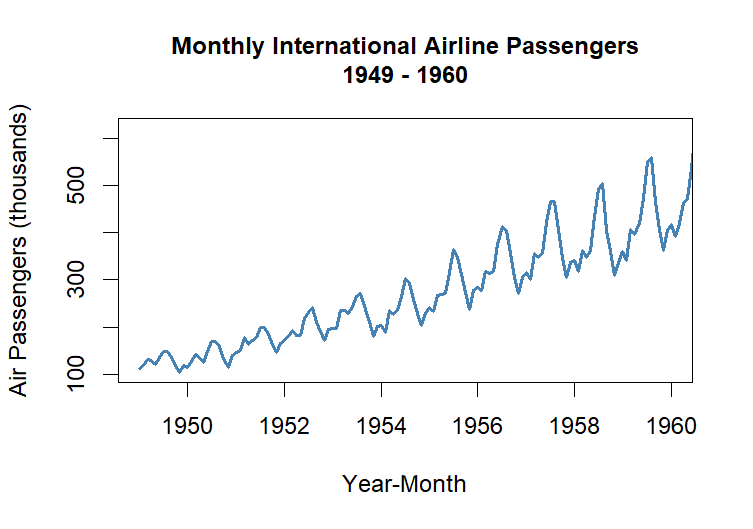
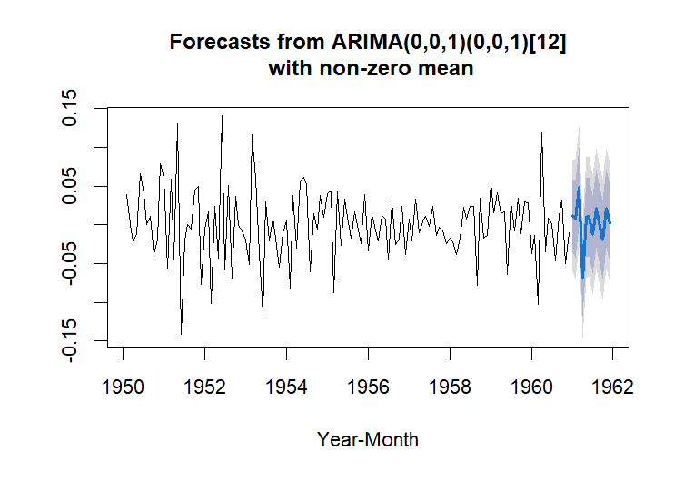

# AirPassengers Time Series Analysis and Forecasting

## Project Overview
This project analyzes the classic **AirPassengers** dataset using time series techniques in R. The goal is to model and forecast monthly totals of international airline passengers using SARIMA models.
<p align="center">
  <br>
  <em>Figure: Monthly international airline passengers showing strong trend and seasonality.</em> 
</p>

## Methods
The analysis includes the following steps:

- Time series visualization
- Log transformation to stabilize variance
- Seasonal differencing to achieve stationarity
- ACF and PACF analysis
- SARIMA model identification and selection
- Model diagnostics (ACF, Q-Q plot, Ljung–Box test)
- Forecast generation

## Results
A SARIMA model was selected based on **AIC and diagnostic checks**. The model successfully captures both the **trend and seasonal patterns** in the data and provides short-term forecasts for future passenger totals.
<p align="center">
  <br>
  <em>Figure: SARIMA model forecast with prediction intervals.</em>
</p>

## Reports
- Reproducible analysis (R Markdown output): `reports/airpassengers_analysis.pdf`
- Final forecasting report: `reports/airpassengers_forecast_report.pdf`

The full reproducible analysis and the final report are available in the `reports/` folder.

## Repository Structure

```
airpassengers-time-series-analysis/
├── data/
│ └── airpassengers.csv
├── figures/
│ ├── time_series_plot.png
│ └── forecast_plot.png
├── reports/
│ ├── airpassengers_analysis.Rmd
│ ├── airpassengers_analysis.pdf
│ └── airpassengers_forecast_report.pdf
├── scripts/
│ └── airpassengers_analysis.R
├── .gitignore
├── LICENSE
└── README.md
```
## Technologies
- **R**
- `atsa`
- `forecast`
- `fUnitRoots`
- **RMarkdown**
